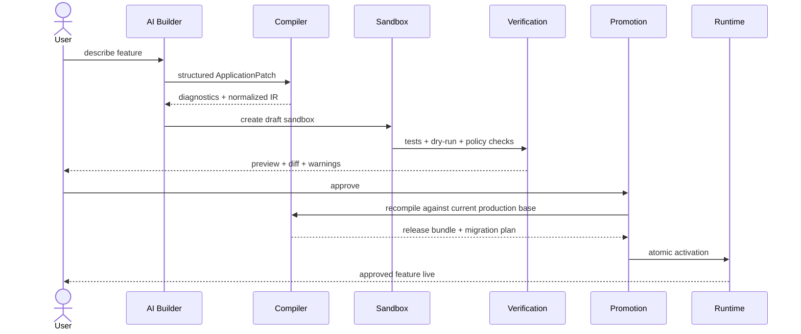

# Requirement → Production Sequence

```mermaid
sequenceDiagram
 actor U as User
 participant A as AI Builder
 participant C as Compiler
 participant S as Sandbox
 participant V as Verification
 participant P as Promotion
 participant R as Runtime

 U->>A: describe feature
 A->>C: structured ApplicationPatch
 C-->>A: diagnostics + normalized IR
 A->>S: create draft sandbox
 S->>V: tests + dry-run + policy checks
 V-->>U: preview + diff + warnings
 U->>P: approve
 P->>C: recompile against current production base
 C-->>P: release bundle + migration plan
 P->>R: atomic activation
 R-->>U: approved feature live
```

Promotion fails on stale base conflict; it must rebase/recompile/retest.
